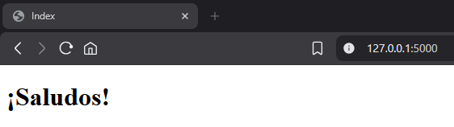
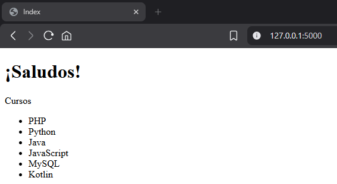
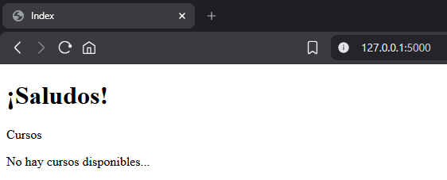

# Plantillas

Las plantillas `Jinja2` + `HTML` son el “motor de vistas” de `Flask`: permiten escribir páginas `HTML` que se vuelven dinámicas, usando `variables`, `bucles`, `condicionales`, `herencia` y más, todo desde el mismo archivo `.html`.

## ¿Dónde se crean las plantillas?

`Flask` busca automáticamente las plantillas en una carpeta llamada `templates` al mismo nivel que tu archivo principal (`app.py`, `run.py`, etc.):

```text
mi_proyecto/
├── app.py
├── routes/
│   └── rutas.py
└── templates/          ← aquí van los HTML + Jinja2
    ├── base.html
    ├── index.html
    └── usuarios.html
```

Dentro de la carpeta `templates` creamos los archivos `.html` normales, pero con extensiones Jinja2 (`{{ ... }}`, ``).

## ¿Por qué se crean plantillas?

- Separar la lógica de `Python` de la presentación en `HTML`.

- Evitar repetir código `HTML` (por ejemplo, el menú o el pie de página).

- Generar `HTML` distinto según los datos que llegan de la base de datos o formularios.

Por ejemplo: creamos un `index.html` en la carpeta `templates`, para poder utilizarla como página principal, en el archivo `rutas.py` de la carpeta `routes` podemos llamarla utilizando `render_template` de la siguiente forma:

```py
@rutas_bp.route('/')
def princ():
    return render_template('index.html')
```

Ya que la ruta apunta a una página principal con `'/'`, nuestro `index.html` será nuestra página `html` principal.

## ¿Qué pueden contener?

Un archivo `templates/index.html` puede contener:

- `HTML` estándar.

- Variables de `Python`.

- Estructuras de control: `if`, `for`, `macros`, etc.

- Herencia de una plantilla `base.html`.

- Llamadas a funciones y filtros.

- `HTML` con enlaces a tus rutas y archivos estáticos (`css`, `js`).

Ahora veamos un ejemplo de como utilizar estructuras de control en `HTML`.

```py
@rutas_bp.route('/')
def inicio():
    # diccionario
    dato = {
        'titulo': 'Index',
        'bienvenida': '¡Saludos!'
    }
    return render_template('index.html', data=dato)
```

Bien, hemos creado un diccionario y lo pasamos al `render_template`. Ahora veamos el `HTML`:

```html
<!DOCTYPE html>
<html lang="es">
<head>
    <meta charset="UTF-8">
    <meta name="viewport" content="width=device-width, initial-scale=1.0">
    <title>Plantillas en Flask</title>
</head>
<body>
    <!-- Pasamos el diccionario al h1 -->
    <h1>{{ data }}</h1>
    
</body>
</html>
```

Salida:

```py
{'titulo': 'Index', 'bienvenida': '¡Saludos!'}
```

Ahora veamos como utilizar el diccionario en el `HTML`:

```html
<body>
    <!-- Pasamos el diccionario al h1 -->
    <h1>{{ data.bienvenida }}</h1>
    
</body>
```

Salida:

```text
¡Saludos!
```

Ahora vamos a cambiar el titulo de la página:

```html
<!DOCTYPE html>
<html lang="es">
<head>
    <meta charset="UTF-8">
    <meta name="viewport" content="width=device-width, initial-scale=1.0">
    <title>{{ data.titulo }}</title>
</head>
<body>
    <!-- Pasamos el diccionario al h1 -->
    <h1>{{ data.bienvenida }}</h1>
    
</body>
</html>
```

Salida:



Ahora vamos a utilizar el bucle `for` en el `HTML`:

Vamos a crear una lista en la ruta para utilizarla con el bucle `for` para que nos muestre el contenido de la lista:

```py
@rutas_bp.route('/')
def inicio():
    # Lista
    cursos = ['PHP', 'Python', 'Java', 'JavaScript', 'MySQL', 'Kotlin']
    # vamos a utilizar un diccionario
    dato = {
        'titulo': 'Index',
        'bienvenida': '¡Saludos!'
        # agregamos la lista al diccionario
        'cursos': cursos,
        'num_cursos': len(cursos)
    }
    return render_template('index.html', data=dato)
```

Ahora vamos a utilizar la etiqueta `<ul>` para mostrar la lista con el bucle `for`:

```html
<body>
    <!-- Pasamos el diccionario al h1 -->
    <h1>{{ data.bienvenida }}</h1>
    
    <p>Cursos</p>
    <ul>
        <!-- Iniciamos el bucle for -->
        
        <li>{{ c }}</li>
        <!-- Terminamos el bucle for -->
        
    </ul>
</body>
```

Salida:



Vamos a utilizar la condicional `if` para verificar que la lista sea mayor que 0, osea, que tenga contenido, si no tiene contenido mostraremos un párrafo que diga "No hay cursos disponibles...":

```html
<body>
    <!-- Pasamos el diccionario al h1 -->
    <h1>{{ data.bienvenida }}</h1>
    
    <p>Cursos</p>
    <!-- Iniciamos la condicional if -->
    

    <ul>
        
        <li>{{ c }}</li>
        
    </ul>
    <!-- Utilizamos la condicional else -->
    
    <p>No hay cursos disponibles...</p>
    <!-- Terminamos la condicional if -->
    
</body>
```

Para que se vea mejor, vamos a colocar en 0 la variable `num_cursos`:

```py
dato = {
        'titulo': 'Index',
        'bienvenida': '¡Saludos!'
        # agregamos la lista al diccionario
        'cursos': cursos,
        'num_cursos': 0 # lo colocamos en 0
    }
```

Salida:



Y con la longitud de cursos:

